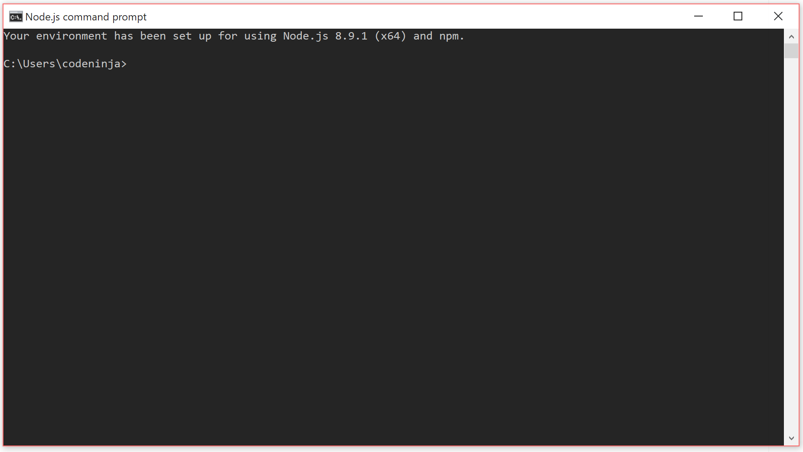

# Windows - Development Environment

This is a setup guide for getting Angular and Angular Material working on your local environment. Please note, the settings presented will only be suitable for a local environment. The guide will be split into different sections that include:

1. [NodeJS and Node Package Manager (npm)](#NodeJS and Node Package Manager (npm))
2. [Angular CLI and Angular project](#Angular CLI and Angular project)
3. [Angular Material](#Angular Material)

---

##NodeJS and Node Package Manager (npm)

[Download NodeJS](https://nodejs.org/en/download/)

The first thing you will need is a version of NodeJS. This project will be developed with the latest Long-Term Support release 8.9.1. This package also comes with Node Package Manager (npm) version 5.5.1. 

| REFERENCES                               |
| ---------------------------------------- |
| More information about NodeJS can be found within their [guides](https://nodejs.org/en/docs/guides/). |
| More information about npm can be found within their [documentations](https://docs.npmjs.com/). |


#### Follow this:

1. Go to the folder where you downloaded the `node-v8.9.1-x64.msi`.
2. Install by following the installation guide. 
3. npm will be installed along with each NodeJS version.
4. Once installed, check you have the Node.js Command Prompt by opening your `start` bar or clicking your Windows button and searching for it. 



5. Check npm and node have been installed correctly by typing:

```bash
> node -v 
v8.9.1
> npm -v
5.5.1
```

##### Local vs Global Packages

There are two ways to install NodeJS packages: locally or globally. You choose which kind of installation to use based on how you want to use the package.

If you want to use it as a command line tool, something like the grunt CLI, then you want to install it globally. On the other hand, if you want to depend on the package from your own module using something like Node's `require`, then you want to install locally.

To download packages globally, you simply use the command `npm install -g <package>`.

------

## Angular CLI and Angular project

| REFERENCES                               |
| ---------------------------------------- |
| Angular Quickstart Guide {{ "AQS" \| cite }} |
| Angular CLI GitHub {{ "ACLI" \| cite }}  |


####  Step 1. Set up the Development Environment

Install **Node.js and npm** if they are not already on your machine.

> NOTE:
>
> **Verify that you are running at least node 6.9.x and npm 3.x.x** by running `node -v` and `npm -v` in a terminal/console window. Older versions produce errors, but newer versions are fine.

Install the [Angular CLI](https://github.com/angular/angular-cli) globally.

```bash
$ npm install -g @angular/cli
```


## Angular Material

//

//


 