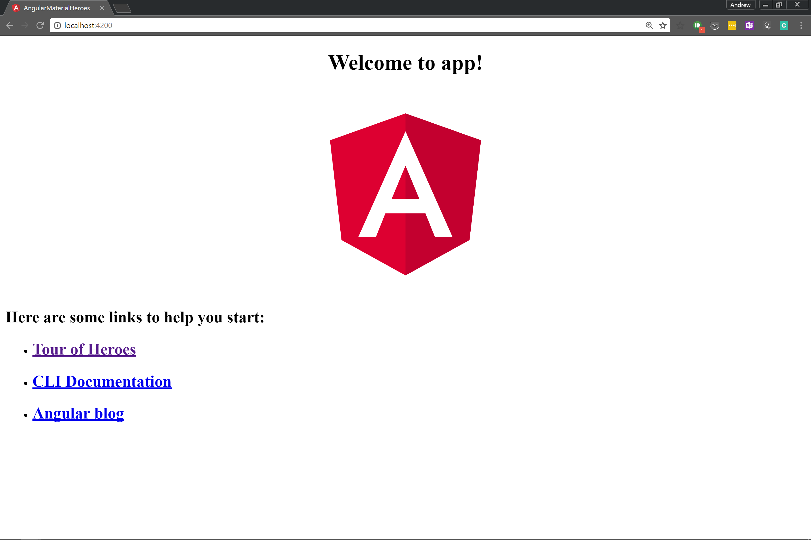
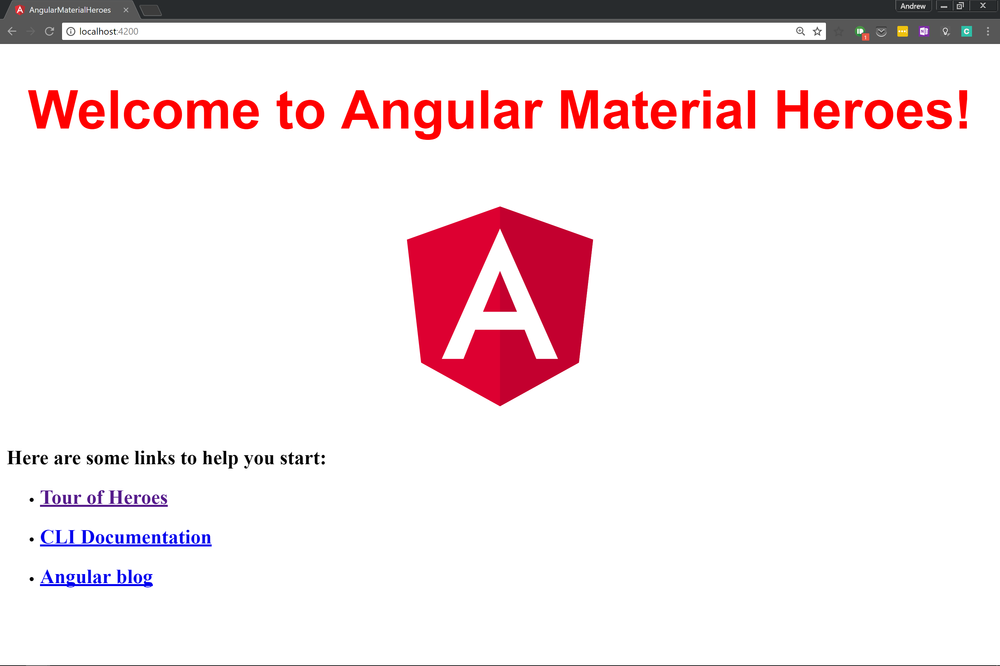

# Windows - Development Environment

This is a setup guide for getting Angular and Angular Material working on your local environment. Please note, the settings presented will only be suitable for a local environment. The guide will be split into different sections that include:

1. [NodeJS and Node Package Manager (npm)](#NodeJS and Node Package Manager (npm))
2. [Angular CLI and Angular project](#Angular CLI and Angular project)
3. [Angular Material](#Angular Material)
4. [(Optional) WebStorm Project Configurations](#(Optional) WebStorm Project Configurations)

---

##NodeJS and Node Package Manager (npm)

[Download NodeJS](https://nodejs.org/en/download/)

The first thing you will need is a version of NodeJS. This project will be developed with the latest Long-Term Support release 8.9.1. This package also comes with Node Package Manager (npm) version 5.5.1. 

| REFERENCES                               |
| ---------------------------------------- |
| More information about NodeJS can be found within their [guides](https://nodejs.org/en/docs/guides/). |
| More information about npm can be found within their [documentations](https://docs.npmjs.com/). |


#### Steps:

1. Go to the folder where you downloaded the `node-v8.9.1-x64.msi`.
2. Install by following the installation guide. 
3. npm will be installed along with each NodeJS version.
4. Once installed, check you have the Node.js Command Prompt by opening your `start` bar or clicking your Windows button and searching for it. 


5. Check npm and node have been installed correctly by typing:

###### Node.js command prompt

```bash
> node -v 
v8.9.1
> npm -v
5.5.1
```

##### Local vs Global Packages

There are two ways to install NodeJS packages: locally or globally. You choose which kind of installation to use based on how you want to use the package.

If you want to use it as a command line tool, something like the grunt CLI, then you want to install it globally. On the other hand, if you want to depend on the package from your own module using something like Node's `require`, then you want to install locally.

To download packages globally, you simply use the command `npm install -g <package>`.

------

## Angular CLI and Angular project

| REFERENCES               |
| ------------------------ |
| Angular Quickstart Guide |
| Angular CLI GitHub       |


####  Step 1. Set up the Development Environment

Install **Node.js and npm** if they are not already on your machine.

_NOTE:_ **Verify that you are running at least node 6.9.x and npm 3.x.x** by running `node -v` and `npm -v` in a terminal/console window. Older versions produce errors, but newer versions are fine.

Open up you Node.js Command Prompt 

Install the [Angular CLI](https://github.com/angular/angular-cli) globally.

###### Node.js command prompt

```bash
> npm install -g @angular/cli
```


#### Step 2. Create a new project

Generate a new project and skeleton application by running the following commands:

###### Node.js command prompt

```bash
> ng new angular-material-heroes
...
Installing packages for tooling via npm.
Installed packages for tooling via npm.
Project 'angular-material-heroes-boilerplate' successfully created.
```

_NOTE:_ This will create a directory 

#### Step 3: Serve the application

Go to the project directory and launch the server.

###### Node.js command prompt

```bash
> cd angular-material-heroes
> ng serve --open

** NG Live Development Server is listening on localhost:4201, open your browser on http://localhost:4201/ **
 10% building modules 6/8 modules 2 active ...rver\client\index.js?http://0.0.0.0:0webpack: wait until bundle fDate: 2017-11-29T16:41:53.343Z
Hash: 8b906764dfcee4688983
Time: 16962ms
chunk {inline} inline.bundle.js (inline) 5.79 kB [entry] [rendered]
chunk {main} main.bundle.js (main) 21.5 kB [initial] [rendered]
chunk {polyfills} polyfills.bundle.js (polyfills) 557 kB [initial] [rendered]
chunk {styles} styles.bundle.js (styles) 34.2 kB [initial] [rendered]
chunk {vendor} vendor.bundle.js (vendor) 7.04 MB [initial] [rendered]

webpack: Compiled successfully.
```
_NOTES:_

* The `ng serve` command launches the server, watches your files, and rebuilds the app as you make changes to those files.
* Using the `--open` (or just `-o`) option will automatically open your browser on `http://localhost:4200/`.
* You can configure the default HTTP host and port used by the development server with two command-line options: `ng serve --host 0.0.0.0 --port 4201`


Your app greets you with a message:





##### Angular CLI Common Commands

You can find all possible blueprints in the table below:

| Scaffold                                 | Usage                             |
| ---------------------------------------- | --------------------------------- |
| [Component](https://github.com/angular/angular-cli/wiki/generate-component) | `ng g component my-new-component` |
| [Directive](https://github.com/angular/angular-cli/wiki/generate-directive) | `ng g directive my-new-directive` |
| [Pipe](https://github.com/angular/angular-cli/wiki/generate-pipe) | `ng g pipe my-new-pipe`           |
| [Service](https://github.com/angular/angular-cli/wiki/generate-service) | `ng g service my-new-service`     |
| [Class](https://github.com/angular/angular-cli/wiki/generate-class) | `ng g class my-new-class`         |
| [Guard](https://github.com/angular/angular-cli/wiki/generate-guard) | `ng g guard my-new-guard`         |
| [Interface](https://github.com/angular/angular-cli/wiki/generate-interface) | `ng g interface my-new-interface` |
| [Enum](https://github.com/angular/angular-cli/wiki/generate-enum) | `ng g enum my-new-enum`           |
| [Module](https://github.com/angular/angular-cli/wiki/generate-module) | `ng g module my-module`           |


#### Step 4: Edit your first Angular component

The CLI created the first Angular component for you. This is the *root component* and it is named `app-root`. You can find it in `./src/app/app.component.ts`.

Open the component file and change the `title` property from *Welcome to app!!* to *Welcome to Angular Material Heroes*:

###### src/app/app.component.ts

```typescript
export class AppComponent {
  title = 'Angular Material Heroes';
}
```

The browser reloads automatically with the revised title. That's nice, but it could look better.

Open `src/app/app.component.css` and give the component some style.

###### src/app/app.component.css

```css
h1 {
  color: red;
  font-family: Arial, Helvetica, sans-serif;
  font-size: 400%;
}
```





## Project file review

The first file you should check out is `README.md`. It has some basic information on how to use CLI commands. Whenever you want to know more about how Angular CLI works make sure to visit [the Angular CLI repository](https://github.com/angular/angular-cli) and [Wiki](https://github.com/angular/angular-cli/wiki).


#### The `src` folder

Your app lives in the `src` folder. All Angular components, templates, styles, images, and anything else your app needs go here. Any files outside of this folder are meant to support building your app.


```
src
	---| app
	------| app.component.css
	------| app.component.html
	------| app.component.spec.ts
	------| app.component.ts
	------| app.module.ts
	---| assets
	------| .gitkeep
	--| environments
	------| environment.prod.ts
	------| environment.ts
	--| favicon.ico
	--| index.html
	--| main.ts
	--| polyfills.ts
	--| styles.css
	--| test.ts
	--| tsconfig.app.json
	--| tsconfig.spec.json
```


| File                                     | Purpose                                  |
| ---------------------------------------- | ---------------------------------------- |
| `app/app.component.{ts,html,css,spec.ts}` | Defines the `AppComponent` along with an HTML template, CSS stylesheet, and a unit test. It is the **root** component of what will become a tree of nested components as the application evolves. |
| `app/app.module.ts`                      | Defines `AppModule`, the [root module](https://angular.io/guide/bootstrapping) that tells Angular how to assemble the application. Right now it declares only the `AppComponent`. |
| `assets/*`                               | A folder where you can put images and anything else to be copied wholesale when you build your application. |
| `environments/*`                         | This folder contains one file for each of your destination environments, each exporting simple configuration variables to use in your application. The files are replaced on-the-fly when you build your app. You might use a different API endpoint for development than you do for production or maybe different analytics tokens. |
| `favicon.ico`                            | Every site wants to look good on the bookmark bar. Get started with your very own Angular icon. |
| `index.html`                             | The main HTML page that is served when someone visits your site. Most of the time you'll never need to edit it. The CLI automatically adds all `js` and `css` files when building your app so you never need to add any `<script>` or `<link>` tags here manually. |
| `main.ts`                                | The main entry point for your app. Compiles the application with the [JIT compiler](https://angular.io/guide/glossary#jit) and bootstraps the application's root module (`AppModule`) to run in the browser. You can also use the [AOT compiler](https://angular.io/guide/aot-compiler) without changing any code by appending the`--aot` flag to the `ng build` and `ng serve` commands. |
| `polyfills.ts`                           | Different browsers have different levels of support of the web standards. Polyfills help normalize those differences. You should be pretty safe with `core-js` and `zone.js`, but be sure to check out the [Browser Support guide](https://angular.io/guide/browser-support) for more information. |
| `styles.css`                             | Your global styles go here. Most of the time you'll want to have local styles in your components for easier maintenance, but styles that affect all of your app need to be in a central place. |
| `test.ts`                                | This is the main entry point for your unit tests. It has some custom configuration that might be unfamiliar, but it's not something you'll need to edit. |
| `tsconfig.[app|spec].json` | TypeScript compiler configuration for the Angular app (`tsconfig.app.json`) and for the unit tests (`tsconfig.spec.json`). |


#### The root folder

The `src/` folder is just one of the items inside the project's root folder. Other files help you build, test, maintain, document, and deploy the app. These files go in the root folder next to `src/`.


```
angular-material-heroes
	---| e2e
	------| app.e2e-spec.ts
	------| app.po.ts
	------| tsconfig.e2e.json
	---| node_modules/...
	---| src/...
	---| .angular-cli.json
	---| .editorconfig
	---| .gitignore
	---| karma.conf.js
	---| package.json
	---| protractor.conf.js
	---| README.md
	---| tsconfig.json
	---| tslint.json
```


| File                 | Purpose                                  |
| -------------------- | ---------------------------------------- |
| `e2e/`               | Inside `e2e/` live the end-to-end tests. They shouldn't be inside `src/` because e2e tests are really a separate app that just so happens to test your main app. That's also why they have their own `tsconfig.e2e.json`. |
| `node_modules/`      | `Node.js` creates this folder and puts all third party modules listed in `package.json` inside of it. |
| `.angular-cli.json`  | Configuration for Angular CLI. In this file you can set several defaults and also configure what files are included when your project is built. Check out the official documentation if you want to know more. |
| `.editorconfig`      | Simple configuration for your editor to make sure everyone that uses your project has the same basic configuration. Most editors support an `.editorconfig` file. See [http://editorconfig.org](http://editorconfig.org/) for more information. |
| `.gitignore`         | Git configuration to make sure autogenerated files are not commited to source control. |
| `karma.conf.js`      | Unit test configuration for the [Karma test runner](https://karma-runner.github.io/), used when running `ng test`. |
| `package.json`       | `npm` configuration listing the third party packages your project uses. You can also add your own [custom scripts](https://docs.npmjs.com/misc/scripts)here. |
| `protractor.conf.js` | End-to-end test configuration for [Protractor](http://www.protractortest.org/), used when running `ng e2e`. |
| `README.md`          | Basic documentation for your project, pre-filled with CLI command information. Make sure to enhance it with project documentation so that anyone checking out the repo can build your app! |
| `tsconfig.json`      | TypeScript compiler configuration for your IDE to pick up and give you helpful tooling. |
| `tslint.json`        | Linting configuration for [TSLint](https://palantir.github.io/tslint/) together with [Codelyzer](http://codelyzer.com/), used when running `ng lint`. Linting helps keep your code style consistent. |


## Angular Material

| REFERENCES |
| ---------- |
|            |
|            |


## (Optional) JetBrains WebStorm Project Configurations


https://www.jetbrains.com/help/webstorm/angular.html

https://blog.jetbrains.com/webstorm/2016/04/angular-2-workflow-in-webstorm/

https://blog.jetbrains.com/webstorm/2017/01/debugging-angular-apps/

https://blog.jetbrains.com/webstorm/2017/02/your-first-unit-test-using-angular-cli-karma-and-webstorm/

https://blog.jetbrains.com/webstorm/2017/09/debugging-node-js-apps-in-webstorm/


