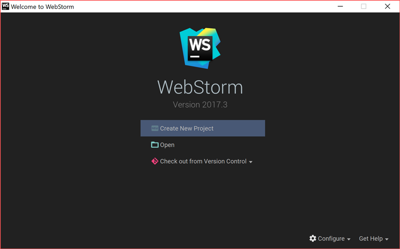
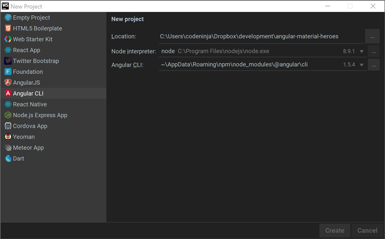
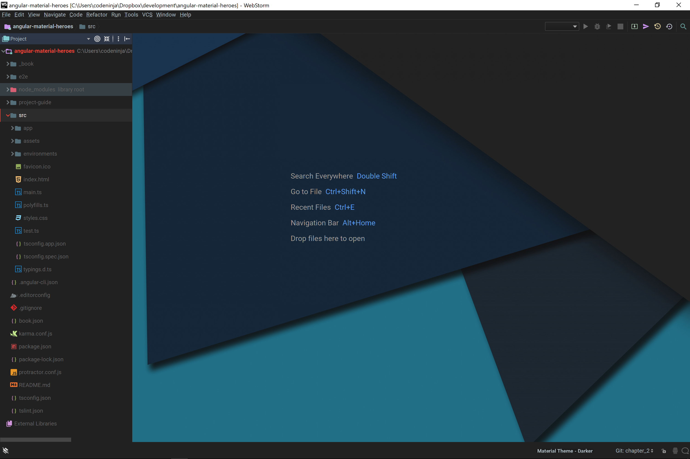
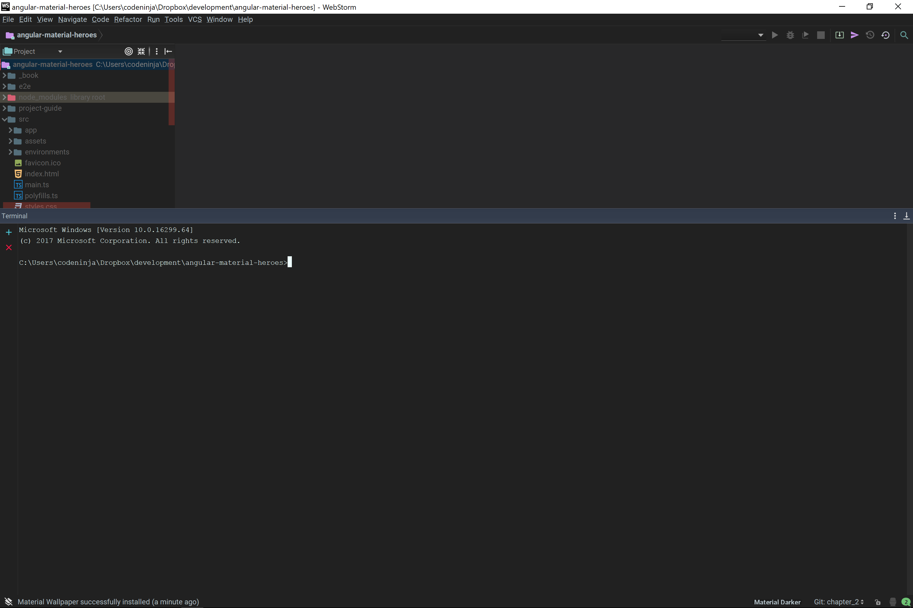
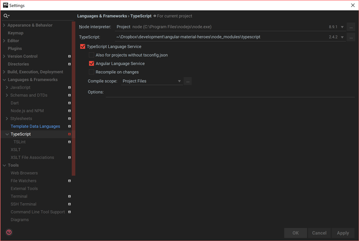

## (Optional) JetBrains WebStorm Project Configurations

| REFERENCES                               |
| ---------------------------------------- |
| [1]: https://www.jetbrains.com/help/webstorm/angular.html "WebStorm 2017.3 Help Angular" |
| [2]: https://blog.jetbrains.com/webstorm/2016/04/angular-2-workflow-in-webstorm/ "Angular workflow in WebStorm" |
| [3]: https://blog.jetbrains.com/webstorm/2017/01/debugging-angular-apps/ "Debugging Angular Apps" |
| [4]: https://blog.jetbrains.com/webstorm/2017/02/your-first-unit-test-using-angular-cli-karma-and-webstorm/ "Your First Unit Test Using Angular CLI, Karma, and WebStorm" |
| [5]: https://blog.jetbrains.com/webstorm/2017/09/debugging-node-js-apps-in-webstorm/ "Debugging NodeJS Apps in WebStorm" |

Please note your WebStorm will not look the same as the images presented below. This is because WebStorm allows you change themes (as do most other editors) and I currently use a dark [Material theme UI](https://plugins.jetbrains.com/plugin/8006-material-theme-ui) downloaded via plugin.


#### Step 1. Create a new project

When you first open WebStorm without having started a project previously, you will be greeted with this dialog. 



Select `Create New Project` even if you are importing an existing project like we are here. Optionally, you can also create the project by `Chech out from Version Control`.



##### Follow this:

1. Select `Angular CLI` from the options on the left menu.
2. Select the `Location:` by browsing to the directory where Angular CLI created the project. 
3. Select your `Node interpreter:`. On most Windows systems, if installed through with an executable, it can be found at `C:\Program Files\nodejs\node.exe`.
4. Select the location of `Angular CLI` in your system. If installed globally with npm, it can be found at `C:\Users\user\AppData\Roaming\npm\node_modules\@angular\cli`.
5. WebStorm will prompt with the message `The directory ... is not empty. Would you like to create a project from existing sources instead?`. Select `Yes`.
6. WebStorm will then greet you with something similar to this once loaded:



For more options on how to create projects, consult the help documentation from JetBrains [WebStorm 2017.3 Help][1].

### Command line tool

WebStorm comes with many features but one of the simplest and most convenient is the ability to use the in-built Terminal/Command line tool which connects to the local systems Windows command prompt. To open up the `Terminal` feature, you can either press `Ctrl` + `F12` or go to __View > Tool Windows > Terminal__.

From the terminal, you can run `npm` and `ng` commands directly. 

 


### Generating Angular structures

In an Angular CLI project, you can have specific structures generated automatically.

1. On the main menu, choose __File > New > Angular CLI__.
2. In the pop-up list that opens, click the relevant type of structure.
3. In the dialog box that opens, specify the name of the structure to be generated and the path to it relative to the `src/app` folder of your project. If you want to generate a structure in a separate folder, create this folder first. This does not apply to components, which are by default generated in separate folders unless the `--flat` option is specified.
   - If necessary, specify additional options, for example, `--flat` to have a new component generated directly in the specified location without creating a separate folder.

### Using Angular language service

WebStorm supports integration with the [Angular language service](http://angularjs.blogspot.ru/2016/12/angular-230-now-available.html) developed by the Angular team to improve code analysis and completion for Angular-TypeScript projects. Note that the Angular language service works only with the projects that use Angular 2.3.1 or higher and TypeScript version compatible with it. Also make sure you have a `tsconfig.json` file in your project.

To install the @angular/language-service package:

###### BASH Shell_or_ WebStorm Terminal

```bash
$ npm install @angular/language-service –save-dev
```

The Angular language service is activated by default so WebStorm starts it automatically together with the TypeScript service and shows all the errors and warnings in your TypeScript and HTML files both in the editor and in the [TypeScript Tool Window](https://www.jetbrains.com/help/webstorm/typescript-tool-window.html). 




### Using Angular Material Design components

One of the best features about WebStorm that will become very handy in this project is the ability of the editor to recognise and autocomplete Angular Material component and attributes. WebStorm automatically can do this if you have followed the steps to install [Angular Material via npm](./2.1.3.md).

Completion for components:


_Image courtesy of_ [WebStorm 2017.3 Help][1].

Completion for attributes:


_Image courtesy of_ [WebStorm 2017.3 Help][1].