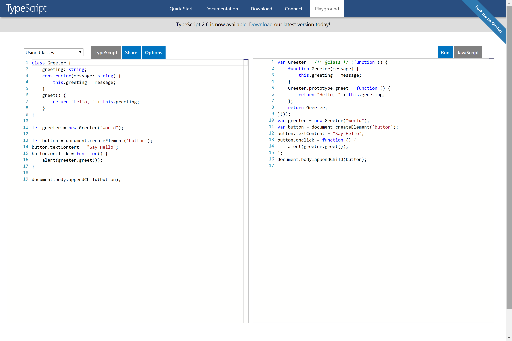

# TypeScript Basics

In this chapter, we will explore some basics of TypeScript from the [TypeScript Documentation Handbook](https://www.typescriptlang.org/docs/home.html).

This chapter will be evolving with content added as we approach them during the Angular tutorial. A deep understanding of TypeScript is not necessary for Angular (which allows the use of JavaScript as well as TypeScript). However, since Angular is written in TypeScript, a good understanding of the syntactical style of TypeScript can be advantageous for larger development projects.


## What is TypeScript?

| REFERENCES                               |
| ---------------------------------------- |
| [1]: https://en.wikipedia.org/wiki/TypeScript "TypeScript" |
| [2]: https://github.com/Microsoft/TypeScript/blob/master/doc/spec.md#1 "TypeScript Language Specification" |
| [3]: https://johnpapa.net/typescriptpost1/ "TypeScript Fundamentals" |
| [4]: https://basarat.gitbooks.io/typescript/content/ "TypeScript Deep Dive" |


> TypeScript is a free and open-source programming language developed and maintained by Microsoft. It is a strict syntactical superset of JavaScript, and adds optional static typing to the language. Anders Hejlsberg, lead architect of C# and creator of Delphi and Turbo Pascal, has worked on the development of TypeScript. TypeScript may be used to develop JavaScript applications for client-side or server-side (Node.js) execution.
>
> [TypeScript, Wikipedia][1]


> TypeScript is a syntactic sugar for JavaScript. TypeScript syntax is a superset of ECMAScript 2015 (ES2015) syntax. Every JavaScript program is also a TypeScript program. The TypeScript compiler performs only file-local transformations on TypeScript programs and does not re-order variables declared in TypeScript. This leads to JavaScript output that closely matches the TypeScript input. TypeScript does not transform variable names, making tractable the direct debugging of emitted JavaScript. TypeScript optionally provides source maps, enabling source-level debugging. TypeScript tools typically emit JavaScript upon file save, preserving the test, edit, refresh cycle commonly used in JavaScript development. 
>
> [TypeScript Language Specification][2]


## Why do we need TypeScript?

| REFERENCES                               |
| ---------------------------------------- |
| [5]: https://blogs.msdn.microsoft.com/somasegar/2012/10/01/typescript-javascript-development-at-application-scale/ "TypeScript: JavaScript Development at Application Scale" |
| [6]: https://johnpapa.net/es5-es2015-typescript/ "Understanding ES5, ES2015 and TypeScript" |
| [7]: https://basarat.gitbooks.io/typescript/content/docs/why-typescript.html "Why TypeScript" |
| [8]: R.H. Jansen, _Learning TypeScript_. Birmingham, UK, Packt Publishing Ltd., 2015. [Online]. Available at: https://www.packtpub.com/web-development/learning-typescript. |


As you may have noticed in the naming, TypeScript introduces types to the JavaScript language. But why do we need to use it at all? If you do a quick Google search of the matter, there are many arguments out. I have referenced some above for your reading. However, in my research, these points from Jansen (2015) provide yet the clearest reasons why TypeScript will be needed in your Angular development projects:

> * Annotating our code with types ensures a consistent integration of our different code units and improves code readability and comprehension. 
> * The TypeScript's built-in type-checker will analyze your code at runtime and help you prevent errors even before executing your code.
> * The use of types ensures consistency across your applications. In combination with the previous two, the overall code errors footprint gets minimized in the long run. 
> * TypeScript extends classes with longtime demanded features such as class fields, private members, enums, and so on. 
> * The use of decorators opens the door to extend our classes and implementations in unparalleled ways. 
> * Creating interfaces and type definition files (which we will not cover in this book though) ensures a smooth and seamless integration of our libraries in other systems and codebases. 
> * TypeScript support across the different IDEs on store is terrific, and we can benefit from code highlighting, real-time type checking, and automatic compilation at no cost. 
> * The TypeScript syntax will definitely please developers coming from other backgrounds such as Java, C#, C++, and so on.
>
> [8, Ch. 2][8]


## Installation

| REFERENCES                               |
| ---------------------------------------- |
| [9] https://www.typescriptlang.org/docs/handbook/typescript-in-5-minutes.html "TypeScript in 5 Minutes" |

There are two main ways to get the TypeScript tools:

* Via npm (the Node.js package manager)
* By installing TypeScript’s Visual Studio plugins


#### npm

###### Node.js command prompt

```bash
> npm install -g typescript
+ typescript@2.6.2
added 1 package in 2.338s
```

###### BASH Shell

```bash
$ npm install -g typescript
+ typescript@2.6.2
added 1 package in 0.927s
```


#### Create a TypeScript file to compile

###### hello.ts

```typescript
var person: string = prompt("Name please: ")

function greeter(person: string) {
  alert("Hello " + person)
}

greeter(person)
```


At the command line, run the TypeScript compiler:

```bash
$ tsc hello.ts
```


You will now see in the same directory a new JavaScript file `hello.js`.


If you would to try more TypeScript syntax, you can use the online editor provided by the TypeScript team at Microsoft.


[__TypeScript Playground__](https://www.typescriptlang.org/play/index.html)

[](https://www.typescriptlang.org/play/index.html)

