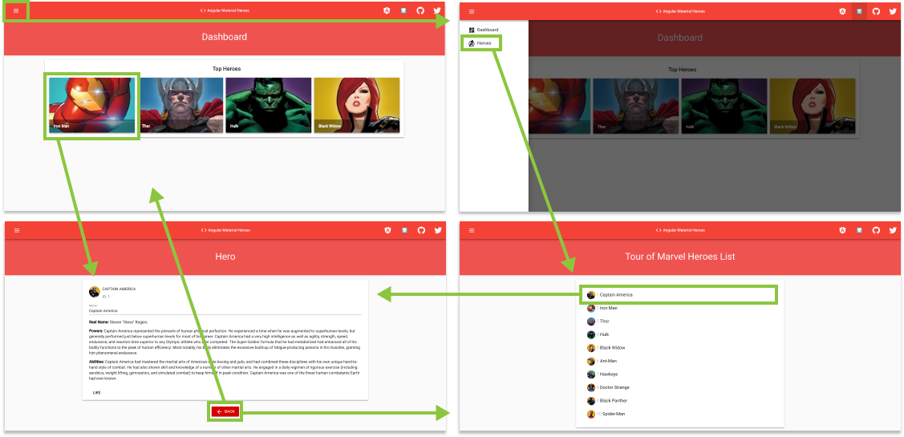

# Tutorial: Routing

| REFERENCES                               |
| ---------------------------------------- |
| [1]: https://angular.io/tutorial/toh-pt5 "Routing" |

------

There are new requirements for the Tour of Heroes app:

- Add a *Dashboard* view.
- Add the ability to navigate between the *Heroes* and *Dashboard* views.
- When users click a hero name in either view, navigate to a detail view of the selected hero.
- When users click a *deep link* in an email, open the detail view for a particular hero.

When you’re done, users will be able to navigate the app like this:





#### Add the *AppRoutingModule*

An Angular best practice is to load and configure the router in a separate, top-level module that is dedicated to routing and imported by the root `AppModule`.

By convention, the module class name is `AppRoutingModule` and it belongs in the `app-routing.module.ts` in the `src/app` folder.

Use the CLI to generate it.

```bash
$ ng g module app-routing --flat --module=app
```

* `--flat` puts the file in `src/app` instead of its own folder.
* `--module=app` tells the CLI to register it in the `imports` array of the `AppModule`.

The generated file looks like this:

###### src/app/app-routing.module.ts

```typescript
import { NgModule } from '@angular/core';
import { CommonModule } from '@angular/common';

@NgModule({
  imports: [
    CommonModule
  ],
  declarations: []
})

export class AppRoutingModule { }
```

You generally don't declare components in a routing module so you can delete the `@NgModule.declarations` array and delete `CommonModule`references too.

You'll configure the router with `Routes` in the `RouterModule` so import those two symbols from the `@angular/router` library.

Add an `@NgModule.exports` array with `RouterModule` in it. Exporting `RouterModule` makes router directives available for use in the `AppModule` components that will need them.

`AppRoutingModule` looks like this now:

###### src/app/app-routing.module.ts

```typescript
import { NgModule } from '@angular/core';
import { RouterModule, Routes } from '@angular/router';

@NgModule({
  exports: [ RouterModule ]
})

export class AppRoutingModule {}
```


#### Add routes

*Routes* tell the router which view to display when a user clicks a link or pastes a URL into the browser address bar.

A typical Angular `Route` has two properties:

1. `path`: a string that matches the URL in the browser address bar.
2. `component`: the component that the router should create when navigating to this route.

You intend to navigate to the `HeroesComponent` when the URL is something like `localhost:4200/heroes`.

Import the `HeroesComponent` so you can reference it in a `Route`. Then define an array of routes with a single `route` to that component.

###### src/app/app-routing.module.ts

```typescript
...

const routes: Routes = [
  { path: 'heroes', component: HeroesComponent }
];

@NgModule({
  ...
})

export class AppRoutingModule { }
```

Once you've finished setting up, the router will match that URL to `path: 'heroes'` and display the `HeroesComponent`.


#### *RouterModule.forRoot()*

You first must initialize the router and start it listening for browser location changes.

Add `RouterModule` to the `@NgModule.imports` array and configure it with the `routes` in one step by calling `RouterModule.forRoot()` *within*the `imports` array, like this:

###### src/app/app-routing.module.ts

```typescript
...

@NgModule({
  imports: [ RouterModule.forRoot(routes) ],
  exports: [ RouterModule ]
})

export class AppRoutingModule { }
```

> The method is called `forRoot()` because you configure the router at the application's root level. The `forRoot()` method supplies the service providers and directives needed for routing, and performs the initial navigation based on the current browser URL.


#### Add *RouterOutlet*

Open the `AppComponent` template replace the `<app-heroes>` element with a `<router-outlet>` element.

###### src/app/app.component.html

```html
...

<mat-sidenav-container class="sidenav-container">

  ...

  <mat-sidenav-content>
    <div class="col align-middle align-content-center red py-4">
      <h1 class="mat-display-1 text-center white-text mb-0">{{ title }}</h1>
    </div>

    <div class="col-sm-12">
      <router-outlet></router-outlet>
    </div>

  </mat-sidenav-content>
</mat-sidenav-container>
```

You removed `<app-heroes>` because you will only display the `HeroesComponent` when the user navigates to it.

The `<router-outlet>` tells the router where to display routed views.

> The `RouterOutlet` is one of the router directives that became available to the `AppComponent` because `AppModule` imports `AppRoutingModule` which exported `RouterModule`.

The browser should refresh and display the app title but not the list of heroes.

Look at the browser's address bar. The URL ends in `/`. The route path to `HeroesComponent` is `/heroes`.

Append `/heroes` to the URL in the browser address bar. You should see the familiar heroes master/detail view.


#### Add a navigation link (*routerLink*)

Users shouldn't have to paste a route URL into the address bar. They should be able to click a link to navigate.

Add a `<nav>` element and, within that, an anchor element that, when clicked, triggers navigation to the `HeroesComponent`. The revised `AppComponent` template looks like this:

###### src/app/app.component.html

```typescript
<app-mat-navbar (navToggle)="sidenav.toggle()"></app-mat-navbar>

<mat-sidenav-container class="sidenav-container">
  <mat-sidenav #sidenav class="sidenav white red-text pt-2" mode="over" 
  [opened]="false" [fixedInViewport]="fixed" [fixedTopGap]="0" [fixedBottomGap]="0">

    <div class="col p-0">
      <mat-nav-list class="mat-nav-list" (click)="sidenav.close()">
        <mat-list-item>
          <a matLine class="pl-3" routerLink="/heroes">
            
            &nbsp;Heroes
          </a>
        </mat-list-item>
      </mat-nav-list>
    </div>

  </mat-sidenav>

  <mat-sidenav-content>
    <div class="col align-middle align-content-center red lighten-1 py-5">
      <h1 class="mat-display-1 text-center white-text mb-0">{{ title }}</h1>
    </div>

    <div class="col-sm-12">
      <router-outlet></router-outlet>
    </div>

  </mat-sidenav-content>
</mat-sidenav-container>

```

A [`routerLink` attribute](https://angular.io/tutorial/toh-pt5#routerlink) is set to `"/heroes"`, the string that the router matches to the route to `HeroesComponent`. The `routerLink` is the selector for the [`RouterLink` directive](https://angular.io/tutorial/toh-pt5#routerlink) that turns user clicks into router navigations. It's another of the public directives in the `RouterModule`.

The browser refreshes and displays the app title and heroes link, but not the heroes list.

Click the link. The address bar updates to `/heroes` and the list of heroes appears.

Please note, for our sidenav example, it is very import you add the ng-click attribute `(click)=sidenav.close()` otherwise the sidenav will not close when you click on a link. 

---

### Introducing the Angular Material Grid list `<mat-grid-list>`

`mat-grid-list` is a two-dimensional list view that arranges cells into grid-based layout. See Material Design spec [here](https://www.google.com/design/spec/components/grid-lists.html). For example:

```html
<mat-grid-list cols="2" rowHeight="2:1">
  <mat-grid-tile>1</mat-grid-tile>
  <mat-grid-tile>2</mat-grid-tile>
  <mat-grid-tile>3</mat-grid-tile>
  <mat-grid-tile>4</mat-grid-tile>
</mat-grid-list>
```

##### Setting the number of columns

An `mat-grid-list` must specify a `cols` attribute which sets the number of columns in the grid. The number of rows will be automatically determined based on the number of columns and the number of items.

##### Setting the row height

The height of the rows in a grid list can be set via the `rowHeight` attribute. Row height for the list can be calculated in three ways:

1. **Fixed height**: The height can be in `px`, `em`, or `rem`. If no units are specified, `px` units are assumed (e.g. `100px`, `5em`, `250`).
2. **Ratio**: This ratio is column-width:row-height, and must be passed in with a colon, not a decimal (e.g. `4:3`).
3. **Fit**: Setting `rowHeight` to `fit` This mode automatically divides the available height by the number of rows. Please note the height of the grid-list or its container must be set.

If `rowHeight` is not specified, it defaults to a `1:1` ratio of width:height.

##### Setting the gutter size

The gutter size can be set to any `px`, `em`, or `rem` value with the `gutterSize` property. If no units are specified, `px` units are assumed. By default the gutter size is `1px`.

##### Adding tiles that span multiple rows or columns

It is possible to set the rowspan and colspan of each `mat-grid-tile` individually, using the`rowspan` and `colspan` properties. If not set, they both default to `1`. The `colspan` must not exceed the number of `cols` in the `mat-grid-list`. There is no such restriction on the `rowspan` however, more rows will simply be added for it the tile to fill.

##### Tile headers and footers

A header and footer can be added to an `mat-grid-tile` using the `mat-grid-tile-header`and `mat-grid-tile-footer` elements respectively.

---

### Add a dashboard view

Routing makes more sense when there are multiple views. So far there's only the heroes view.

Add a `DashboardComponent` using the CLI:

```bash
$ ng g component dashboard --module=app.module
```

The CLI generates the files for the `DashboardComponent` and declares it in `AppModule`.

#### Refactor the templates to display the title in each individual view

###### src/app/app.componet.html

```html
<app-mat-navbar (navToggle)="sidenav.toggle()"></app-mat-navbar>

<mat-sidenav-container class="sidenav-container">
  ...

  <mat-sidenav-content>
    <!-- Remove the Bootstrap column grid container from here -->
    <router-outlet></router-outlet>
  </mat-sidenav-content>
</mat-sidenav-container>

```

###### src/app/heroes/heroes.component.html

```html
<!-- This title can now span the whole width of the page -->
<div class="col align-middle align-content-center red lighten-1 py-5">
  <h1 class="mat-display-1 text-center white-text mb-0">Tour of Marvel Heroes List</h1>
</div>

<!-- The column now only applies to the list of this component -->
<div class="col-sm-12">
  <div class="row mt-3">
    <div class="col-sm-6 offset-sm-3">
      <mat-card class="mat-elevation-z3 mat-typography">
        <mat-nav-list class="">
          <mat-list-item *ngFor="let hero of heroes" (click)="onSelect(hero)"
                         [class.selected]="hero === selectedHero">
            <a matLine href="#" aria-disabled="false">
              
              <p class="hero-list blue-grey-text text-lighten-3">{{ hero.id }}</p>
              <p class="hero-list">{{ hero.name}}</p>
            </a>
          </mat-list-item>
        </mat-nav-list>
      </mat-card>
    </div>
  </div>
</div>

<app-hero-detail [hero]="selectedHero"></app-hero-detail>
```


#### Import the `MatGridListModule`

###### src/app/app.module.ts

```typescript
...

import { MatGridListModule } from '@angular/material/grid-list'

@NgModule({
  declarations: [
    ...
    
    DashboardComponent,
  ],
  imports: [
	...
    
    MatGridListModule,
  ],
  entryComponents: [],
  providers: [ HeroService, MessageService ],
  bootstrap: [ AppComponent ]
})

export class AppModule { }

```


#### Create the Dashboard template and style

Replace the default file content in these three files as follows and then return for a little discussion:

###### src/app/dashboard/dashboard.component.html

```html
<div class="col align-middle align-content-center red lighten-1 py-5">
  <h1 class="mat-display-1 text-center white-text mb-0">Dashboard</h1>
</div>

<div class="col-sm-10 offset-1 mt-3">
  <mat-card class="mat-elevation-z4 mat-typography p-3">
    <mat-card-header class="align-items-center justify-content-center">
      <h2 class="mat-headline">Top Heroes</h2>
    </mat-card-header>
    <mat-card-content>
      <mat-grid-list cols="4" rowHeight="200px" gutterSize="10px">
        <mat-grid-tile class="mat-grid-list mat-elevation-z4" *ngFor="let hero of heroes">
          <a href="">
            
            <mat-grid-tile-footer class="mat-grid-tile-footer font-weight-bold">
              {{ hero.name }}
            </mat-grid-tile-footer>
          </a>
        </mat-grid-tile>
      </mat-grid-list>
    </mat-card-content>
  </mat-card>
</div>
```

The images used are by default 200x200 pixels. To make them zoom to fit the size of the `<mat-grid-tile>`, we use the following css:

###### src/app/dashboard/dashboard.component.css

```css
mat-grid-tile img {
  zoom: 1.6;
}
```

Finally, configure the dashboard class:

###### src/app/dashboard/dashboard.componet.ts

```typescript
import { Component, OnInit } from '@angular/core';
import { Hero } from '../hero';
import { HeroService } from '../hero.service';

@Component({
  selector: 'app-dashboard',
  templateUrl: './dashboard.component.html',
  styleUrls: ['./dashboard.component.css']
})

export class DashboardComponent implements OnInit {
  heroes: Hero[] = [];

  constructor(private heroService: HeroService) { }

  ngOnInit() {
    this.getHeroes();
  }

  getHeroes() {
    this.heroService.getHeroes()
      .subscribe(heroes => this.heroes = heroes.slice(1, 5));
  }
}
```

The *template* presents a `<mat-grid-list>` of hero avatar images and name footer that is anchored with links.

- The `*ngFor` repeater creates as many links as are in the component's `heroes` array.

The *class* is similar to the `HeroesComponent` class.

- It defines a `heroes` array property.
- The constructor expects Angular to inject the `HeroService` into a private `heroService` property.
- The `ngOnInit()` lifecycle hook calls `getHeroes`.

This `getHeroes` reduces the number of heroes displayed to four (2nd, 3rd, 4th, and 5th).

#### Add the dashboard route

To navigate to the dashboard, the router needs an appropriate route.

Import the `DashboardComponent` in the `AppRoutingModule`. Then, add a route to the `AppRoutingModule.routes` array that matches a path to the `DashboardComponent`.

###### src/app/app-routing.module.ts

```typescript
...

import { DashboardComponent } from './dashboard/dashboard.component';

const routes: Routes = [
  { path: 'heroes', component: HeroesComponent },
  { path: 'dashboard', component: DashboardComponent },
  { path: '', redirectTo: '/dashboard', pathMatch: 'full' }
];

...
```

When the app starts, the browsers address bar points to the web site's root. That doesn't match any existing route so the router doesn't navigate anywhere. The space below the `<router-outlet>` is blank.

To make the app navigate to the dashboard automatically, we add the `{ path: '', redirectTo: '/dashboard', pathMatch: 'full' }` route to the `AppRoutingModule.Routes`.

This route redirects a URL that fully matches the empty path to the route whose path is `'/dashboard'`.

After the browser refreshes, the router loads the `DashboardComponent` and the browser address bar shows the `/dashboard` URL.

#### Add dashboard link to the shell

The user should be able to navigate back and forth between the `DashboardComponent` and the `HeroesComponent` by clicking links in the navigation area near the top of the page.

Add a dashboard navigation link to the `AppComponent` shell template, just above the *Heroes* link.

###### src/app/app.component.html

```html
...

<mat-sidenav-container class="sidenav-container">
  <mat-sidenav #sidenav class="sidenav white red-text pt-2" mode="over" [opened]="false"
               [fixedInViewport]="fixed" [fixedTopGap]="0" [fixedBottomGap]="0">

    <div class="col p-0">
      <!-- Dashboard link added -->
      <mat-nav-list class="mat-nav-list" (click)="sidenav.close()">
        <mat-list-item class="align-middle">
          <a matLine class="pl-3 align-middle" routerLink="/dashboard">
            <mat-icon class="mat-icon align-middle">dashboard</mat-icon>
            &nbsp;Dashboard
          </a>
        </mat-list-item>
        
        <mat-list-item>
          <a matLine class="pl-3" routerLink="/heroes">
            
            &nbsp;Heroes
          </a>
        </mat-list-item>
      </mat-nav-list>
    </div>
  </mat-sidenav>

  ...
</mat-sidenav-container>
```

After the browser refreshes you can navigate freely between the two views by clicking the links.

---

### Navigating to hero details

The `HeroDetailsComponent` displays details of a selected hero. At the moment the `HeroDetailsComponent` is only visible at the bottom of the `HeroesComponent`

The user should be able to get to these details in three ways.

1. By clicking a hero in the dashboard.
2. By clicking a hero in the heroes list.
3. By pasting a "deep link" URL into the browser address bar that identifies the hero to display.

In this section, you'll enable navigation to the `HeroDetailsComponent` and liberate it from the `HeroesComponent`.

#### Delete *hero details* from *HeroesComponent*

When the user clicks a hero item in the `HeroesComponent`, the app should navigate to the `HeroDetailComponent`, replacing the heroes list view with the hero detail view. The heroes list view should no longer show hero details as it does now.

Open the `HeroesComponent` template (`heroes/heroes.component.html`) and delete the `<app-hero-detail>` element from the bottom.

Clicking a hero item now does nothing. You'll [fix that shortly](https://angular.io/tutorial/toh-pt5#heroes-component-links) after you enable routing to the `HeroDetailComponent`.

#### Add a *hero detail* route

A URL like `~/detail/11` would be a good URL for navigating to the *Hero Detail* view of the hero whose `id` is `11`.

Open `AppRoutingModule` and import `HeroDetailComponent`.

Then add a *parameterized* route to the `AppRoutingModule.routes` array that matches the path pattern to the *hero detail* view.

###### src/app/app-routing.module.ts

```typescript
...
import { HeroDetailComponent } from './hero-detail/hero-detail.component';

const routes: Routes = [
  { path: 'heroes', component: HeroesComponent },
  { path: 'dashboard', component: DashboardComponent },
  { path: 'hero/:id', component: HeroDetailComponent },
  { path: '', redirectTo: '/dashboard', pathMatch: 'full' }
];

...
```

The colon (:) in the `path` indicates that `:id` is a placeholder for a specific hero `id`.

At this point, all application routes are in place.

#### *DashboardComponent* hero links

The `DashboardComponent` hero links do nothing at the moment.

Now that the router has a route to `HeroDetailComponent`, fix the dashboard hero links to navigate via the *parameterized* dashboard route.

###### src/app/dashboard/dashboard.component.html

```html
...

<div class="col-sm-10 offset-1 mt-3">
  <mat-card class="mat-elevation-z4 mat-typography p-3">
    
    ...
    
    <mat-card-content>
      <mat-grid-list cols="4" rowHeight="200px" gutterSize="10px">
        <mat-grid-tile class=" mat-elevation-z4" *ngFor="let hero of heroes">
          <a routerLink="/hero/{{ hero.id }}">
            ...
          </a>
        </mat-grid-tile>
      </mat-grid-list>
    </mat-card-content>
  </mat-card>
</div>
```

You're using Angular [interpolation binding](https://angular.io/guide/template-syntax#interpolation) within the `*ngFor` repeater to insert the current interation's `hero.id` into each [`routerLink`](https://angular.io/tutorial/toh-pt5#routerlink).


#### *HeroesComponent* hero links

The hero items in the `HeroesComponent` are `<mat-list-items>` elements with `<a>` tags that we did not yet define. Let's add a `routerLink` for each item now.

Let's also strip the `<mat-list-item>` back to just its `*ngFor`.

###### src/app/heroes/heroes.component.html

```html
...

<div class="col-sm-12">
  <div class="row mt-3">
    <div class="col-sm-6 offset-sm-3">
      <mat-card class="mat-elevation-z3 mat-typography">
        <mat-nav-list class="">
          <!-- Removed (click) and [class.selected] attributes -->
          <mat-list-item *ngFor="let hero of heroes">
            <!-- Added a routerLink for each anchor tag -->
            <a matLine routerLink="/hero/{{ hero.id }}" aria-disabled="false">
              
              <p class="hero-list blue-grey-text text-lighten-3">{{ hero.id }}</p>
              <p class="hero-list">{{ hero.name}}</p>
            </a>
          </mat-list-item>
        </mat-nav-list>
      </mat-card>
    </div>
  </div>
</div>
```


#### Remove dead code (optional)

While the `HeroesComponent` class still works, the `onSelect()` method and `selectedHero` property are no longer used.

It's nice to tidy up and you'll be grateful to yourself later. Here's the class after pruning away the dead code.

###### src/app/heroes/heroes.component.ts

```typescript
...

export class HeroesComponent implements OnInit {
  heroes: Hero[];

  constructor(private heroService: HeroService) { }

  ngOnInit() {
    // Registers to the HeroService Observable
    this.getHeroes();
  }

  getHeroes(): void {
    this.heroService.getHeroes()
      .subscribe(heroes => this.heroes = heroes);
  }
}
```


#### Routable *HeroDetailComponent*

Previously, the parent `HeroesComponent` set the `HeroDetailComponent.hero` property and the `HeroDetailComponent` displayed the hero.

`HeroesComponent` doesn't do that anymore. Now the router creates the `HeroDetailComponent` in response to a URL such as `~/detail/11`.

The `HeroDetailComponent` needs a new way to obtain the *hero-to-display*.

- Get the route that created it,
- Extract the `id` from the route
- Acquire the hero with that `id` from the server via the `HeroService`

Add the following imports for `ActivatedRoute`, `Location` and `HeroService`.

Inject the `ActivatedRoute`, `HeroService`, and `Location` services into the constructor, saving their values in private fields:

###### src/app/hero-detail/hero-detail.component.ts

```typescript
import { Component, OnInit, Input } from '@angular/core';
import { ActivatedRoute } from '@angular/router';
import { Location } from '@angular/common';
import { Hero } from '../hero';
import { HeroService }  from '../hero.service';

@Component({
  selector: 'app-hero-detail',
  templateUrl: './hero-detail.component.html',
  styleUrls: ['./hero-detail.component.css']
})
export class HeroDetailComponent implements OnInit {
  @Input() hero: Hero;

  constructor(
    private route: ActivatedRoute,
    private heroService: HeroService,
    private location: Location
  ) { }

  ngOnInit() { }
}
```

* The [`ActivatedRoute`](https://angular.io/api/router/ActivatedRoute) holds information about the route to this instance of the `HeroDetailComponent`. This component is interested in the route's bag of parameters extracted from the URL. The *"id"* parameter is the `id` of the hero to display.
* The [`HeroService`](https://angular.io/tutorial/toh-pt4) gets hero data from the remote server and this component will use it to get the *hero-to-display*.
* The [`location`](https://angular.io/api/common/Location) is an Angular service for interacting with the browser. You'll use it [later](https://angular.io/tutorial/toh-pt5#goback) to navigate back to the view that navigated here.


#### Extract the *id* route parameter

In the `ngOnInit()` [lifecycle hook](https://angular.io/guide/lifecycle-hooks#oninit) call `getHero()` and define it as follows.

###### src/app/hero-detail/hero-detail.component.ts

```typescript
...

export class HeroDetailComponent implements OnInit {
  @Input() hero: Hero;

  constructor(
    private route: ActivatedRoute,
    private heroService: HeroService,
    private location: Location
  ) { }

  ngOnInit() {
    this.getHero();
  }

  getHero(): void {
    const id = +this.route.snapshot.paramMap.get('id');
    this.heroService.getHero(id)
      .subscribe(hero => this.hero = hero);
  }
}
```

The `route.snapshot` is a static image of the route information shortly after the component was created.

The `paramMap` is a dictionary of route parameter values extracted from the URL. The `"id"` key returns the `id` of the hero to fetch.

Route parameters are always strings. The JavaScript (+) operator converts the string to a number, which is what a hero `id` should be.

The browser refreshes and the app crashes with a compiler error. `HeroService` doesn't have a `getHero()` method. Add it now.


#### Add *HeroService.getHero()*

Open `HeroService` and add this `getHero()` method

###### src/app/hero.service.ts

```typescript
...

@Injectable()
export class HeroService {

  constructor(private messageService: MessageService) { }

  getHeroes(): Observable<Hero[]> {
    // TODO: send the message _after_ fetching the heroes
    this.messageService.showSnackBar('HeroService: fetched heroes');
    return of(HEROES);
  }

  getHero(id: number): Observable<Hero> {
    // TODO: send the message _after_ fetching the hero
    this.messageService.showSnackBar(`HeroService: fetched hero id=${id}`);
    return of(HEROES.find(hero => hero.id === id));
  }
}
```

> Note the backticks ( \` ) that define a JavaScript [*template literal*](https://developer.mozilla.org/en-US/docs/Web/JavaScript/Reference/Template_literals) for embedding the `id`.

Like [`getHeroes()`](https://angular.io/tutorial/toh-pt4#observable-heroservice), `getHero()` has an asynchronous signature. It returns a *mock hero* as an `Observable`, using the RxJS `of()` function.

You'll be able to re-implement `getHero()` as a real `Http` request without having to change the `HeroDetailComponent` that calls it.

#### Try it

The browser refreshes and the app is working again. You can click a hero in the dashboard or in the heroes list and navigate to that hero's detail view.

If you paste `localhost:4200/hero/1` in the browser address bar, the router navigates to the detail view for the hero with `id: 1`, "Captain America".


#### Find the way back

By clicking the browser's back button, you can go back to the hero list or dashboard view, depending upon which sent you to the detail view.

It would be nice to have a button on the `HeroDetail` view that can do that.

Add a *go back* button to the bottom of the component template and bind it to the component's `goBack()` method.

At this point, we will also refactor our `hero-detail.component.html` to be consistent with other views.

###### src/app/hero-detail/hero-detail.component.html

```html
<div class="col align-middle align-content-center red lighten-1 py-5">
  <h1 class="mat-display-1 text-center white-text mb-0">Hero</h1>
</div>

<div class="row" *ngIf="hero">
  <div class="col-sm-8 offset-sm-2 mt-3">
    <mat-card class="mat-elevation-z3 mat-typography">
      <mat-card-header>
        
        <mat-card-title>{{ hero.name | uppercase }}</mat-card-title>
        <mat-card-subtitle><span>ID:</span> {{ hero.id }}</mat-card-subtitle>
      </mat-card-header>
      <!---->
      <mat-card-content>
        <mat-input-container class="d-flex flex-column w-100">
          <input type="text" matInput placeholder="Name:" 
                 [(ngModel)]="hero.name" class="d-flex flex-column w-100">
        </mat-input-container>
        <p><b>Real Name:</b> {{ hero.realName }}</p>
        <p><b>Powers:</b> {{ hero.powers }}</p>
        <p><b>Abilities:</b> {{ hero.abilities }}</p>
      </mat-card-content>
      <mat-card-actions>
        <button mat-button>LIKE</button>
      </mat-card-actions>
    </mat-card>
  </div>
  
  <div class="col-4 offset-4 mt-4 text-center">
    <button mat-raised-button class="mat-raised-button red accent-4 white-text"
            (click)="goBack()">
      <mat-icon>arrow_back</mat-icon>
      &nbsp;BACK
    </button>
  </div>
  
</div>
```

Add a `goBack()` *method* to the component class that navigates backward one step in the browser's history stack using the `Location` service that you [injected previously](https://angular.io/tutorial/toh-pt5#hero-detail-ctor).

###### src/app/hero-detail/hero-detail.component.ts

```typescript
...

export class HeroDetailComponent implements OnInit {
  @Input() hero: Hero;

  constructor(
    private route: ActivatedRoute,
    private heroService: HeroService,
    private location: Location
  ) { }

  ngOnInit() {
    this.getHero();
  }

  getHero(): void {
    const id = +this.route.snapshot.paramMap.get('id');
    this.heroService.getHero(id)
      .subscribe(hero => this.hero = hero);
  }

  goBack(): void {
    this.location.back();
  }
}

```

Refresh the browser and start clicking. Users can navigate around the app, from the dashboard to hero details and back, from heroes list to the mini detail to the hero details and back to the heroes again.

You've met all of the navigational requirements that propelled this page.

---

## Summary

- You added the Angular router to navigate among different components.
- You turned the `AppComponent` into a navigation shell with `<a>` links and a `<router-outlet>`.
- You configured the router in an `AppRoutingModule`
- You defined simple routes, a redirect route, and a parameterized route.
- You used the `routerLink` directive in anchor elements.
- You refactored a tightly-coupled master/detail view into a routed detail view.
- You used router link parameters to navigate to the detail view of a user-selected hero.
- You shared the `HeroService` among multiple components.