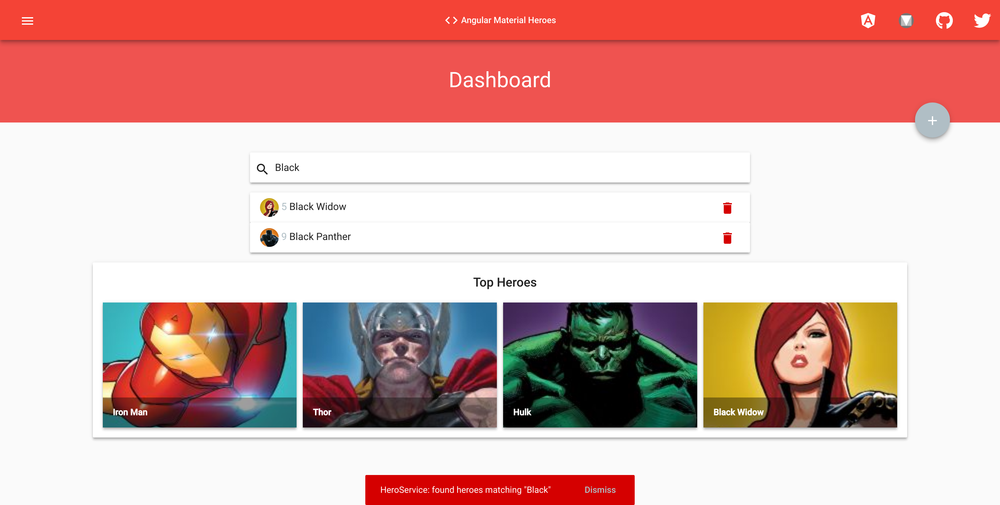

# Tutorial: HTTP continued...

| REFERENCE                                |
| ---------------------------------------- |
| [1]: https://angular.io/tutorial/toh-pt6#update-heroes "Update heroes" |

#### Update heroes

Editing a hero's name in the *hero detail* view. As you type, the hero name updates the heading at the top of the page. But when you click the "go back button", the changes are lost.

If you want changes to persist, you must write them back to the server.

At the end of the hero detail template, add a save button with a `click` event binding that invokes a new component method named `save()`.

###### src/app/hero-detail/hero-detail.component.html

```html
...

<div class="row" *ngIf="hero">
  <div class="col-sm-8 offset-sm-2 mt-3">
    <mat-card class="mat-elevation-z3 mat-typography">
      <mat-card-header>
        ...
      </mat-card-header>
      <mat-card-content>
        ...
      </mat-card-content>
      <mat-card-actions align="start">
        <button mat-button class="red-text text-lighten-2" (click)="save()">
          <mat-icon>
            save
          </mat-icon>
          &nbsp;SAVE
        </button>
        <button mat-button class="red-text text-lighten-2">
          <mat-icon>plus_one</mat-icon>
          &nbsp;LIKE
        </button>
      </mat-card-actions>
    </mat-card>
  </div>

  ...
</div>
```

Add the following `save()` method, which persists hero name changes using the hero service `updateHero()` method and then navigates back to the previous view.

###### src/app/hero-detail/hero-detail.component.ts

```typescript
...

export class HeroDetailComponent implements OnInit {

  ...

  goBack(): void {
    this.location.back();
  }

  save(): void {
    this.heroService.updateHero(this.hero).subscribe(() => this.goBack());
  }
}

```


#### Add *HeroService.updateHero()*

The overall structure of the `updateHero()` method is similar to that of `getHeroes()`, but it uses `http.put()` to persist the changed hero on the server.

###### src/app/hero.service.ts

```typescript
...

import { HttpClient, HttpHeaders } from '@angular/common/http';
import {catchError, tap} from 'rxjs/operators';

const httpOptions = {
  headers: new HttpHeaders({ 'Content-Type': 'application/json' })
};

@Injectable()
export class HeroService {

  ...

  /** PUT: update the hero on the server */
  updateHero(hero: Hero): Observable<any> {
    return this.http.put(this.heroesUrl, hero, httpOptions)
      .pipe(
        tap(() => this.log(`updated hero id=${hero.id}`)),
        catchError(this.handleError<any>('updateHero'))
      );
  }

  ...
}

```

The `HttpClient.put()` method takes three parameters

- the URL
- the data to update (the modified hero in this case)
- options

The URL is unchanged. The heroes web API knows which hero to update by looking at the hero's `id`.

The heroes web API expects a special header in HTTP save requests. That header is in the `httpOptions` constant defined in the `HeroService`.

Refresh the browser, change a hero name, save your change, and click the "go back" button. The hero now appears in the list with the changed name.


#### Add a new hero

To add a hero, we are going to make a simple `HeroFormComponent` which will allow us to define more `<input>`'s' than just the name.

##### Make the `HeroFormComponent`

```bash
$ ng g component hero-form --module=app.module
```

##### Add a route to the `HeroFormComponent`

###### src/app/app-routing.module.ts

```typescript
...

import { HeroFormComponent } from './hero-form/hero-form.component';

const routes: Routes = [
  ...

  { path: 'hero/add', component: HeroFormComponent },
  { path: 'hero/:id', component: HeroDetailComponent },
  { path: '', redirectTo: '/dashboard', pathMatch: 'full' }
];

@NgModule({
  imports: [ RouterModule.forRoot(routes) ],
  exports: [ RouterModule ]
})

export class AppRoutingModule { }

```

> *NOTE:* The order of the routes are important. If you add the 'hero/add' path after the 'hero/:id', the router will try to resolve '/add' as an ID and will throw an error.

##### Import the `MatFormFieldModule`

At this point, we have many imports from Angular Material. We can create a single module that imports all of these for us and then reference it in the `app.module.ts` to make them available to all components. This module will import all required Angular Material modules and then export them to be used in our application.

Make a new `material.module.ts`:

###### src/app/material.module.ts

```typescript
import { NgModule } from '@angular/core';

import { BrowserAnimationsModule } from '@angular/platform-browser/animations';
import {FormsModule, ReactiveFormsModule} from '@angular/forms';
import {
  MatAutocompleteModule,
  MatButtonModule,
  MatButtonToggleModule,
  MatCardModule,
  MatCheckboxModule,
  MatChipsModule,
  MatDatepickerModule,
  MatDialogModule,
  MatExpansionModule,
  MatGridListModule,
  MatIconModule,
  MatInputModule,
  MatListModule,
  MatMenuModule,
  MatNativeDateModule,
  MatPaginatorModule,
  MatProgressBarModule,
  MatProgressSpinnerModule,
  MatRadioModule,
  MatRippleModule,
  MatSelectModule,
  MatSidenavModule,
  MatSliderModule,
  MatSlideToggleModule,
  MatSnackBarModule,
  MatSortModule,
  MatTableModule,
  MatTabsModule,
  MatToolbarModule,
  MatTooltipModule,
  MatStepperModule,
  MAT_PLACEHOLDER_GLOBAL_OPTIONS,
} from '@angular/material';

import { MatFormFieldModule } from '@angular/material/form-field';
import { CdkTableModule } from '@angular/cdk/table';


@NgModule({
  imports: [
    BrowserAnimationsModule,
    CdkTableModule,
    MatAutocompleteModule,
    MatButtonModule,
    MatButtonToggleModule,
    MatCardModule,
    MatCheckboxModule,
    MatChipsModule,
    MatDatepickerModule,
    MatDialogModule,
    MatExpansionModule,
    MatGridListModule,
    MatIconModule,
    MatInputModule,
    MatListModule,
    MatMenuModule,
    MatNativeDateModule,
    MatPaginatorModule,
    MatProgressBarModule,
    MatProgressSpinnerModule,
    MatRadioModule,
    MatRippleModule,
    MatSelectModule,
    MatSidenavModule,
    MatSliderModule,
    MatSlideToggleModule,
    MatSnackBarModule,
    MatSortModule,
    MatTableModule,
    MatTabsModule,
    MatToolbarModule,
    MatTooltipModule,
    MatStepperModule,
    MatFormFieldModule,
    FormsModule,
    ReactiveFormsModule,
  ],
  exports: [
    BrowserAnimationsModule,
    CdkTableModule,
    MatAutocompleteModule,
    MatButtonModule,
    MatButtonToggleModule,
    MatCardModule,
    MatCheckboxModule,
    MatChipsModule,
    MatDatepickerModule,
    MatDialogModule,
    MatExpansionModule,
    MatGridListModule,
    MatIconModule,
    MatInputModule,
    MatListModule,
    MatMenuModule,
    MatNativeDateModule,
    MatPaginatorModule,
    MatProgressBarModule,
    MatProgressSpinnerModule,
    MatRadioModule,
    MatRippleModule,
    MatSelectModule,
    MatSidenavModule,
    MatSliderModule,
    MatSlideToggleModule,
    MatSnackBarModule,
    MatSortModule,
    MatTableModule,
    MatTabsModule,
    MatToolbarModule,
    MatTooltipModule,
    MatStepperModule,
    MatFormFieldModule,
    FormsModule,
    ReactiveFormsModule,
  ],
  providers: [
    {provide: MAT_PLACEHOLDER_GLOBAL_OPTIONS, useValue: {float: 'auto'}}
  ]
})

export class MaterialModule { }
```

Then you will need to import this new module in our application such as:

###### src/app/app.module.ts

```typescript
import { BrowserModule } from '@angular/platform-browser';
import { NgModule } from '@angular/core';
import { FormsModule } from '@angular/forms';

// All Angular Material Modules imported at once
import { MaterialModule } from './material.module';

import { AppComponent } from './app.component';
import { MatNavbarComponent  } from './mat-navbar/mat-navbar.component';
import { HeroesComponent } from './heroes/heroes.component';
import { HeroDetailComponent } from './hero-detail/hero-detail.component';
import { HeroService } from './hero.service';
import { MessageService } from './message.service';
import { AppRoutingModule } from './app-routing.module';
import { DashboardComponent } from './dashboard/dashboard.component';
import { HttpClientModule } from '@angular/common/http';
import { HttpClientInMemoryWebApiModule } from 'angular-in-memory-web-api';
import { InMemoryDataService } from './in-memory-data.service';
import { HeroFormComponent } from './hero-form/hero-form.component';

@NgModule({
  declarations: [
    AppComponent,
    MatNavbarComponent,
    HeroesComponent,
    HeroDetailComponent,
    DashboardComponent,
    HeroFormComponent,
  ],
  imports: [
    BrowserModule,
    MaterialModule,
    FormsModule,
    AppRoutingModule,
    HttpClientModule,

    // The HttpClientInMemoryWebApiModule module intercepts HTTP requests
    // and returns simulated server responses.
    // Remove it when a real server is ready to receive requests.
    HttpClientInMemoryWebApiModule.forRoot(
      InMemoryDataService, { dataEncapsulation: false }
    ),
  ],
  entryComponents: [],
  providers: [ HeroService, MessageService ],
  bootstrap: [ AppComponent ]
})

export class AppModule { }
```

##### Create the form with Angular Material Form controls

###### src/app/hero-form/hero-form.component.html

```html
<div class="col align-middle align-content-center red lighten-1 py-5">
  <h1 class="mat-display-1 text-center white-text mb-0">Add a new Hero</h1>
</div>

<div class="col-lg-6 offset-lg-3 col-md-8 offset-md-2 col-sm-10 offset-sm-1 mt-3">
  <mat-card class="mat-elevation-z3 mat-typography">
    <mat-card-title><h3>Hero Form</h3></mat-card-title>
    <mat-card-subtitle><h4>Let's add a new Marvel Hero.</h4></mat-card-subtitle>

    <mat-card-content>
      <mat-form-field class="d-inline-flex flex-column w-100 mt-2" hintLabel="The name the here prefers to be called.">
        <input matInput #name placeholder="Hero Name" required>
      </mat-form-field>
      <mat-form-field class="d-inline-flex flex-column w-100 mt-3">
        <input matInput #realName placeholder="Real Name">
        <mat-hint>The real name of the hero.</mat-hint>
      </mat-form-field>
      <mat-form-field class="d-inline-flex flex-column w-100 mt-4">
        <textarea matInput #powers placeholder="Hero Powers"></textarea>
        <mat-hint>The super powers the hero possesses.</mat-hint>
      </mat-form-field>
      <mat-form-field class="d-inline-flex flex-column w-100 mt-4">
        <textarea matInput #abilities placeholder="Hero Abilities"></textarea>
        <mat-hint>Other abilities this hero possesses.</mat-hint>
      </mat-form-field>
      <button mat-button class="mt-3 red-text text-lighten-2" routerLink="/heroes"
              (click)="add(name.value, realName.value, powers.value, abilities.value)">
        <mat-icon>send</mat-icon>
        &nbsp;Add
      </button>
      <button mat-button class="mt-3 red-text text-lighten-2"
              (click)="name.value=''; realname.value=''; abilities.value=''; powers.value=''">
        <mat-icon>clear</mat-icon>
        &nbsp;Clear
      </button>
    </mat-card-content>
  </mat-card>
</div>

<div class="col-4 offset-4 mt-4 text-center">
  <button mat-fab class="mat-fab white-text" (click)="goBack()">
    <mat-icon>arrow_back</mat-icon>
  </button>
</div>
```
###### src/app/hero-form/hero-form.component.ts

```typescript
import { Component, OnInit } from '@angular/core';
import { Location } from '@angular/common';
import { HeroService } from '../hero.service';
import { Hero } from '../hero';

@Component({
  selector: 'app-hero-form',
  templateUrl: './hero-form.component.html',
  styleUrls: ['./hero-form.component.css']
})
export class HeroFormComponent implements OnInit {

  constructor(
    private heroService: HeroService,
    private location: Location,
  ) { }

  ngOnInit() { }

  goBack(): void {
    this.location.back();
  }

  add(name: string, realName?: string, powers?: string, abilities?: string) {
    name = name.trim();
    realName = name.trim();
    if (!name) { return; }
    const hero = new Hero(name, realName, powers, abilities);
    console.log(hero);
    this.heroService.addHero(hero)
      .subscribe((newHero: Hero) => console.log(newHero));
  }
}
```

#### Add HeroService.addHero()

Add the following `addHero()`` method to the HeroService class.
###### src/app/hero.service.ts
```typescript
...

@Injectable()
export class HeroService {
  private heroesUrl = 'api/heroes';  // URL to web api

...

  /** POST: add a new hero to the server */
  addHero(hero: Hero): Observable<Hero> {
    return this.http.post<Hero>(this.heroesUrl, hero, httpOptions)
      .pipe(
        tap((newHero: Hero) => this.log(\`added hero w/ id=${newHero.id}\`)),
        catchError(this.handleError<Hero>('addHero'))
      );
  }

...
```


#### Add an Angular Material Floating Action Button (FAB) 

To get to the `HeroFormComponent`, we are going to add a `mat-fab` to link to the hero form from both the `DashboardComponent` and the `HeroesComponent`.

###### src/app/dashboard/dashboard.component.html

```html
<div class="col align-middle align-content-center red lighten-1 py-5">
  <h1 class="mat-display-1 text-center white-text mb-0">Dashboard</h1>
  <button mat-fab class="add-hero-fab white-text" routerLink="/hero/add">
    <mat-icon>add</mat-icon>
  </button>
</div>

...
```

###### src/app/heroes/heroes.component.html

```html
<div class="col align-middle align-content-center red lighten-1 py-5">
  <h1 class="mat-display-1 text-center white-text mb-0">Tour of Marvel Heroes List</h1>
  <button mat-fab class="add-hero-fab white-text" routerLink="/hero/add">
    <mat-icon>add</mat-icon>
  </button>
</div>

...
```

Style the FAB by adding the following CSS in both `src/app/heroes/heroes.component.css` and `src/app/dashboard/dashboard.component.css`.

```css
.add-hero-fab {
  -webkit-box-sizing: border-box;
  -moz-box-sizing: border-box;
  box-sizing: border-box;
  position: absolute;
  right: 1.5rem;
  bottom: -1.5rem;
}

@media(min-width: 1024px) {
  .add-hero-fab {
    right: 5rem;
    bottom: -1.5rem;
  }
}
```

Now clicking on the FAB will allow you to add a new hero.


#### Delete a hero

Each hero in the heroes list should have a delete button.

Add the following button element to the `HeroesComponent` template, after the hero name in the repeated `<mat-list-item>` element.

###### src/app/heroes/heroes.component.html

```html
...

<div class="col-lg-6 offset-lg-3 col-md-10 offset-md-1 mt-5">
  <mat-card class="mat-elevation-z3 mat-typography">
    <mat-nav-list class="">
      <mat-list-item *ngFor="let hero of heroes">
        <a matLine routerLink="/hero/{{ hero.id }}" aria-disabled="false">
          ...
        </a>
        
        <button mat-icon-button class="red-text text-accent-4" (click)="delete(hero)">
          <mat-icon>delete</mat-icon>
        </button>
      </mat-list-item>
    </mat-nav-list>
  </mat-card>
</div>
```

Add the `delete()` handler to the component.

###### src/app/heroes/heroes.component.ts

```typescript
...

export class HeroesComponent implements OnInit {
  heroes: Hero[];

  ...

  delete(hero: Hero): void {
    this.heroes = this.heroes.filter(h => h !== hero);
    this.heroService.deleteHero(hero).subscribe();
  }
}
```

Although the component delegates hero deletion to the `HeroService`, it remains responsible for updating its own list of heroes. The component's `delete()` method immediately removes the *hero-to-delete* from that list, anticipating that the `HeroService` will succeed on the server.

There's really nothing for the component to do with the `Observable` returned by `heroService.delete()`. **It must subscribe anyway**.

> If you neglect to `subscribe()`, the service will not send the delete request to the server! As a rule, an `Observable` *does nothing* until something subscribes!
>
> Confirm this for yourself by temporarily removing the `subscribe()`, clicking "Dashboard", then clicking "Heroes". You'll see the full list of heroes again.

#### Add *HeroService.deleteHero()*

Add a `deleteHero()` method to `HeroService` like this.

###### src/app/hero.service.ts

```typescript
...

@Injectable()
export class HeroService {
  private heroesUrl = 'api/heroes';  // URL to web api

  ...

  /** DELETE: delete the hero from the server */
  deleteHero(hero: Hero | number): Observable<Hero> {
    const id = typeof hero === 'number' ? hero : hero.id;
    const url = `${this.heroesUrl}/${id}`;

    return this.http.delete<Hero>(url, httpOptions)
      .pipe(
        tap (() => this.log(`deleted hero id=${id}`)),
        catchError(this.handleError<Hero>('deleteHero'))
      );
  }

  ...
}

```

Note that

- it calls `HttpClient.delete`.
- the URL is the heroes resource URL plus the `id` of the hero to delete
- you don't send data as you did with `put` and `post`.
- you still send the `httpOptions`.

Refresh the browser and try the new delete functionality.


### Search by name

In this last exercise, you learned to chain `Observable` operators together so you can minimize the number of similar HTTP requests and consume network bandwidth economically.

You will add a *heroes search* feature to the *Dashboard*. As the user types a name into a search box, you'll make repeated HTTP requests for heroes filtered by that name. Your goal is to issue only as many requests as necessary.


#### *HeroService.searchHeroes*

Start by adding a `searchHeroes` method to the `HeroService`.

###### src/app/hero.service.ts

```typescript
...

@Injectable()
export class HeroService {
  ...

  /* GET heroes whose name contains search term */
  searchHeroes(term: string): Observable<Hero[]> {
    if(!term.trim()) {
      // if not search term, return empty hero array.
      return of([]);
    }

    return this.http.get<Hero[]>(`api/heroes/?name=${term}`)
      .pipe(
        tap(() => this.log(`found heroes matching "${term}"`)),
        catchError(this.handleError<Hero[]>('searchHeroes'))
      );
  }

  ...
}
```

The method returns immediately with an empty array if there is no search term. The rest of it closely resembles `getHeroes()`. The only significant difference is the URL, which includes a query string with the search term.


#### Add search to the Dashboard

Open the `DashboardComponent` *template* and Add the hero search element, `<app-hero-search>`, to the bottom of the `DashboardComponent`template.

###### src/app/dashboard/dashboard.component.html

```html

```

This template looks a lot like the `*ngFor` repeater in the `HeroesComponent` template.

Unfortunately, adding this element breaks the app. Angular can't find a component with a selector that matches `<app-hero-search>`.

The `HeroSearchComponent` doesn't exist yet. Fix that.


#### Create *HeroSearchComponent*

Create a `HeroSearchComponent` with the CLI.

```bash
$ ng g component hero-search --module=app.module
```


The CLI generates the three `HeroSearchComponent` and adds the component to the `AppModule' declarations

Replace the generated `HeroSearchComponent` *template* with a text box and a list of matching search results like this.

###### src/app/hero-search/hero-search.component.html

```html
<div class="col-lg-6 offset-lg-3 col-md-8 offset-md-2 col-sm-10 offset-sm-1 mt-5 p-0">
  <mat-card class=" d-flex align-items-center mat-elevation-z3 p-0">
    <mat-form-field class="w-100 px-0 pl-2">
      <mat-icon matPrefix class="align-middle mr-2">search</mat-icon>
      <input type="search" matInput #searchBox title="searchBox" (keyup)="search(searchBox.value)">
    </mat-form-field>
  </mat-card>
</div>

<div class="col-lg-6 offset-lg-3 col-md-8 offset-md-2 col-sm-10 offset-sm-1 mt-3 p-0">
  <mat-card class="mat-elevation-z3 mat-typography p-0" *ngFor="let hero of heroes$ | async">
    <mat-nav-list class="p-0">
      <mat-list-item>
        <a matLine routerLink="/hero/{{ hero.id }}">
          
          <p class="hero-list blue-grey-text text-lighten-3">{{ hero.id }}</p>
          <p class="hero-list">{{ hero.name}}</p>
        </a>
        <button mat-icon-button class="red-text text-accent-4" (click)="delete(hero)">
          <mat-icon>delete</mat-icon>
        </button>
      </mat-list-item>
    </mat-nav-list>
  </mat-card>
</div>

```

###### src/app/hero-search/hero-search.component.css

```css
::ng-deep .mat-input-underline {
  display: none;
}

::ng-deep .mat-input-wrapper {
  padding: 0.5rem 0;
}

::ng-deep .mat-form-field-infix {
  border-top: none;
}

::ng-deep .mat-focused {
  color: #F44336;
}

.hero-list {
  display: inline;
}

.mat-list-avatar {
  width: 30px !important;
  height: 30px !important;
}

.mat-list-item {
  height: 48px !important;
}

.selected {
  background-color: #607d8b !important;
  color: white;
}
```

As the user types in the search box, a *keyup* event binding calls the component's `search()` method with the new search box value.


#### *AsyncPipe*

As expected, the `*ngFor` repeats hero objects.

Look closely and you'll see that the `*ngFor` iterates over a list called `heroes$`, not `heroes`.

```html
<mat-list-item *ngFor="let hero of heroes$ | async">
```

The `$` is a convention that indicates `heroes$` is an `Observable`, not an array.

The `*ngFor` can't do anything with an `Observable`. But there's also a pipe character (`|`) followed by `async`, which identifies Angular's `AsyncPipe`.

The `AsyncPipe` subscribes to an `Observable` automatically so you won't have to do so in the component class.


#### Fix the *HeroSearchComponent* class

Replace the generated `HeroSearchComponent` class and metadata as follows.

###### src/app/hero-search/hero-search.component.ts

```typescript
import { Component, OnInit } from '@angular/core';

import { Observable } from 'rxjs/Observable';
import { Subject } from 'rxjs/Subject';
import { of } from 'rxjs/observable/of';
import {
  debounceTime,
  distinctUntilChanged,
  switchMap
} from 'rxjs/operators';

import { Hero } from '../hero';
import { HeroService } from '../hero.service';

@Component({
  selector: 'app-hero-search',
  templateUrl: './hero-search.component.html',
  styleUrls: ['./hero-search.component.css']
})

export class HeroSearchComponent implements OnInit {
  heroes$: Observable<Hero[]>;
  private searchTerms = new Subject<string>();

  constructor(private heroService: HeroService) { }

  // Push a search term into the observable stream.
  search(term: string): void {
    this.searchTerms.next(term);
  }

  ngOnInit(): void {
    this.heroes$ = this.searchTerms.pipe(
      // wait 300ms after each keystroke before considering the term
      debounceTime(300),
      // ignore new term if same as previous term
      distinctUntilChanged(),
      // switch to new search observable each time the term changes
      switchMap(
        (term: string) => this.heroService.searchHeroes(term)
      ),
    );
  }
}
```

Notice the declaration of `heroes$` as an `Observable`

```typescript
heroes$: Observable<Hero[]>;
```

You'll set it in [`ngOnInit()`](https://angular.io/tutorial/toh-pt6#search-pipe). Before you do, focus on the definition of `searchTerms`.


#### The *searchTerms* RxJS subject

The `searchTerms` property is declared as an RxJS `Subject`.

```typescript
private searchTerms = new Subject<string>();

// Push a search term into the observable stream.
search(term: string): void {
  this.searchTerms.next(term);
}
```

A `Subject` is both a source of *observable* values and an `Observable` itself. You can subscribe to a `Subject` as you would any `Observable`.

You can also push values into that `Observable` by calling its `next(value)` method as the `search()` method does.

The `search()` method is called via an *event binding* to the textbox's `keystroke` event.

```html
<input type="search" matInput #searchBox title="searchBox" (keyup)="search(searchBox.value)">
```

Every time the user types in the textbox, the binding calls `search()` with the textbox value, a "search term". The `searchTerms` becomes an `Observable` emitting a steady stream of search terms.


#### Chaining RxJS operators

Passing a new search term directly to the `searchHeroes()` after every user keystroke would create an excessive amount of HTTP requests, taxing server resources and burning through the cellular network data plan.

Instead, the `ngOnInit()` method pipes the `searchTerms` *observable* through a sequence of RxJS operators that reduce the number of calls to the `searchHeroes()`, ultimately returning an *observable* of timely hero search results (each a `Hero[]`).

Here's the code.

```typescript
this.heroes$ = this.searchTerms.pipe(
  // wait 300ms after each keystroke before considering the term
  debounceTime(300),

  // ignore new term if same as previous term
  distinctUntilChanged(),

  // switch to new search observable each time the term changes
  switchMap((term: string) => this.heroService.searchHeroes(term)),
);
```

- `debounceTime(300)` waits until the flow of new string events pauses for 300 milliseconds before passing along the latest string. You'll never make requests more frequently than 300ms.


- `distinctUntilChanged` ensures that a request is sent only if the filter text changed.


- `switchMap()` calls the search service for each search term that makes it through `debounce` and `distinctUntilChanged`. It cancels and discards previous search observables, returning only the latest search service observable.

> With the [switchMap operator](http://www.learnrxjs.io/operators/transformation/switchmap.html), every qualifying key event can trigger an `HttpClient.get()` method call. Even with a 300ms pause between requests, you could have multiple HTTP requests in flight and they may not return in the order sent.
>
> `switchMap()` preserves the original request order while returning only the observable from the most recent HTTP method call. Results from prior calls are canceled and discarded.
>
> Note that *canceling* a previous `searchHeroes()` *Observable* doesn't actually abort a pending HTTP request. Unwanted results are simply discarded before they reach your application code.

Remember that the component *class* does not subscribe to the `heroes$` *observable*. That's the job of the [`AsyncPipe`](https://angular.io/tutorial/toh-pt6#asyncpipe) in the template.

#### Try it

Run the app again. In the *Dashboard*, enter some text in the search box. If you enter characters that match any existing hero names, you'll see something like this.





## Summary

You're at the end of your journey, and you've accomplished a lot.

- You added the necessary dependencies to use HTTP in the app.
- You refactored `HeroService` to load heroes from a web API.
- You extended `HeroService` to support `post()`, `put()`, and `delete()` methods.
- You updated the components to allow adding, editing, and deleting of heroes.
- You configured an in-memory web API.
- You learned how to use Observables.

This concludes the "Tour of Heroes" tutorial. You're ready to learn more about Angular development in the fundamentals section, starting with the [Architecture](https://angular.io/guide/architecture) guide.