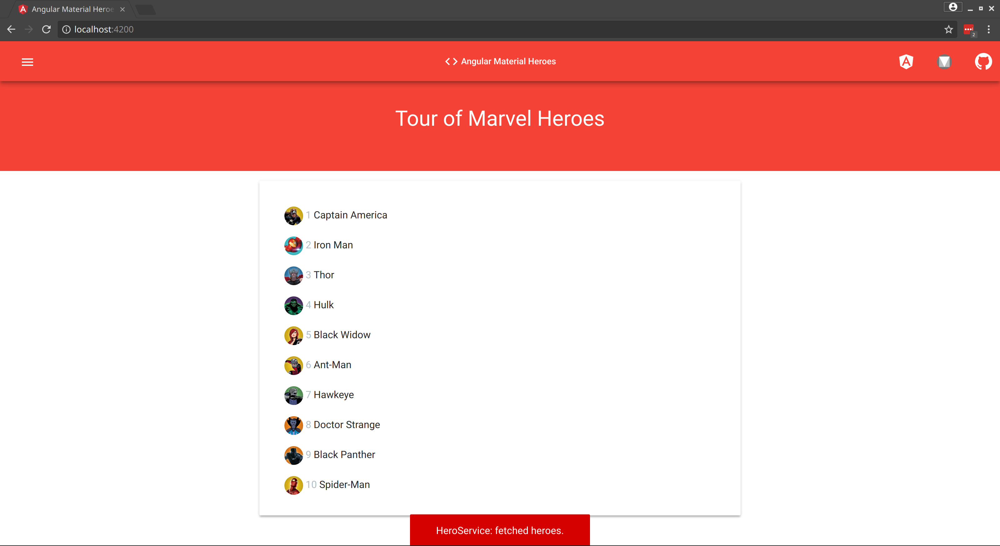

# Tutorial: Angular Material Snackbar

| REFERENCES                               |
| ---------------------------------------- |
| [1]: https://material.angular.io/components/snack-bar/overview "Sncakbar" |

------

#### Refactoring with Angular Material `MatSnackBar`

Our project currently uses the Hero Service to retrieve data from a source. After it retrieves that data, it uses the *service in service* technique with the Message Service to retrieve a message from the MessageComponent. This however, can be improved both visually and with less code. To do this, we will use the Angular Material Snackbar to display the same message.


#### Introducing the `MatSnackBar`

`MatSnackBar` is a service for displaying snack-bar notifications.

##### Opening a snack-bar

A snack-bar can contain either a string message or a given component.

```typescript
// Simple message.
let snackBarRef = snackBar.open('Message archived');

// Simple message with an action.
let snackBarRef = snackBar.open('Message archived', 'Undo');

// Load the given component into the snack-bar.
let snackBarRef = snackbar.openFromComponent(MessageArchivedComponent);

```

In either case, a `MatSnackBarRef` is returned. This can be used to dismiss the snack-bar or to receive notification of when the snack-bar is dismissed. For simple messages with an action, the`MatSnackBarRef` exposes an observable for when the action is triggered. If you want to close a custom snack-bar that was opened via `openFromComponent`, from within the component itself, you can inject the `MatSnackBarRef`.

```typescript
snackBarRef.afterDismissed().subscribe(() => {
  console.log('The snack-bar was dismissed');
});


snackBarRef.onAction().subscribe(() => {
  console.log('The snack-bar action was triggered!');
});

snackBarRef.dismiss();
```

##### Dismissal

A snack-bar can be dismissed manually by calling the `dismiss` method on the `MatSnackBarRef`returned from the call to `open`.

Only one snack-bar can ever be opened at one time. If a new snackbar is opened while a previous message is still showing, the older message will be automatically dismissed.

A snack-bar can also be given a duration via the optional configuration object:

```typescript
snackbar.open('Message archived', 'Undo', {
  duration: 3000
});
```

##### Sharing data with a custom snack-bar

You can share data with the custom snack-bar, that you opened via the `openFromComponent`method, by passing it through the `data` property.

```typescript
snackbar.openFromComponent(MessageArchivedComponent, {
  data: 'some data'
});

```

To access the data in your component, you have to use the `MAT_SNACK_BAR_DATA` injection token:

```typescript
import {Component, Inject} from '@angular/core';
import {MAT_SNACK_BAR_DATA} from '@angular/material';

@Component({
  selector: 'your-snack-bar',
  template: 'passed in {{ data }}',
})
export class MessageArchivedComponent {
  constructor(@Inject(MAT_SNACK_BAR_DATA) public data: any) { }
}
```


#### Import the `MatSnackBarModule`

The firs thing is to import the `MatSnacBarModule` in our app module. Also add the `MessagesComponent` as an `entryComponent`.  An entry component is any component that Angular loads *imperatively* by type. A component loaded *declaratively* via its selector is *not* an entry component. To learn more about `entryComponent` refer to the [documentation FAQ](https://angular.io/guide/ngmodule-faq#what-is-an-entry-component).

###### src/app/app.module.ts

```typescript
...

import { MatSnackBarModule } from '@angular/material';

@NgModule ({
  declarations: [
    ...	
  ],
  imports: [
    	...
      	MatSnackBarModule,
  ],
  entryComponent: [ MessagesComponent ],
  providers: [ HeroService, MessageService ],
  bootstrap: [ AppComponent ]
})

...
```


#### Using the `MatSnackBar`

Currently, we have multiple options in using the `MatSnackBar`. We could use it directly from the `HeroService` and avoid using our `MessageService` at all. We could also use it from the `MessageService` without a `MessageComponent`  instance. And finally, we could leverage the `MatSnackBar` method `openFromComponent()` and render the `MessageComponent` template in our message. The choice of how to use it will be up to you. 

In this part of the tutorial, I will show you how to use it with the `MessageService` both with and without the `MessageComponet`. The reason we would use the `MessageService` is to maintain our application logic in separate layers. A `HeroService` retrieves the data and a `MessageService` sends a snack bar message to the user. 


#### Refactor the `MessageService` to use `MatSnackBar` and `MatSnackBarConfig`

In our first refactor, we will leverage the already created `MessageComponent` to display the message we want from `messages.component.html` template. Using the `MatSnackBarConfig` also provides us with a way to add additional metadata to our snack bar. Currently, our `MessageService` looks like this:

###### src/app/message.service.ts (without MatSnackBar)

```typescript
import { Injectable } from '@angular/core';

@Injectable()
export class MessageService {
  messages: string[] = [];

  add(message: string): void {
    this.messages.push(message);
  }

  clear(): void {
    this.messages = [];
  }
}
```

Refactor this to use the `MatSnackBar` and `MatSnackBarConfig`.

###### src/app/message.service.ts

```typescript
import { Injectable } from '@angular/core';
import { MatSnackBar, MatSnackBarConfig } from '@angular/material';
import { MessagesComponent } from './messages/messages.component';

@Injectable()
export class MessageService {

  constructor(private snackbar: MatSnackBar) { }

  showSnackBar(message: string) {
    const config = new MatSnackBarConfig();
    config.duration = 2000;
    config.horizontalPosition = 'center';
    config.verticalPosition = 'bottom';
    config.panelClass = ['red', 'accent-4', 'text-center', 'white-text'];

    this.snackbar.openFromComponent(MessagesComponent, config);
  }
}
```

To be begin, import the required components with `import { MatSnackBar, MatSnackBarConfig } from '@angular/material';`. 

In this example, we are injecting a `MatSnackBar` into the service when the `MessageService` is instantiated with `constructor(private snackbar: MatSnackBar) { }`. We are also using the `MessageComponent` without ever declaring it. This is however possible because we are dynamically creating the components when we set `entryComponent: [ MessagesComponent ]` in the `app.module.ts`. 

We then create the `showSnackBar(message: string)` method to be used to display the message. In this method, we create a `config` constant with a `MatSnackBarConfig()` object. From there, we can set the following properties to be used by `snackbar` component:

##### Properties

| Name                                     | Description                              |
| ---------------------------------------- | ---------------------------------------- |
| `announcementMessage: string`            | Message to be announced by the MatAriaLiveAnnouncer |
| `data: any`                              | Data being injected into the child component. |
| `direction: Direction`                   | Text layout direction for the snack bar. |
| `duration: number`                       | The length of time in milliseconds to wait before automatically dismissing the snack bar. |
| `horizontalPosition: MatSnackBarHorizontalPosition` | The horizontal position to place the snack bar. |
| `panelClass: string | string[]`          | Extra CSS classes to be added to the snack bar container. |
| `politeness: AriaLivePoliteness`         | The politeness level for the MatAriaLiveAnnouncer announcement. |
| `verticalPosition: MatSnackBarVerticalPosition` | The vertical position to place the snack bar. |
| `viewContainerRef: ViewContainerRef`     | The view container to place the overlay for the snack bar into. |

In our particular example, we can leverage the CSS selectors from `materials-colours.css` and `bootstrap-helpers.css` to style our `MessageComponent`. The `horizontalPosition` and `verticalPosition` is by default set to this however, if you so wish, you could change these values. Finally, the `duration` is set to 2000 millseconds to be automatically dismissed.

To render the `MessageComponent` template, we must make some adjustments to `MessageComponent`. The component files should now look like this:

###### src/app/messages/messages.component.ts

```typescript
import { Component, OnInit } from '@angular/core';

@Component({
  selector: 'app-messages',
  templateUrl: './messages.component.html',
  styleUrls: ['./messages.component.css']
})

export class MessagesComponent implements OnInit {

  constructor() { }

  ngOnInit() { }
}
```

###### src/app/messages/messages.component.html

```html
<span>HeroService: fetched heroes.</span>
```

We must also remove the `<app-messages>` from `app.component.html` which should now look as if it did before:

###### src/app/app.component.html

```html
<app-mat-navbar></app-mat-navbar>

<div class="container-fluid">
  <div class="row red pt-5">
    <div class="col-sm-12 no-gutters">
      <h1 class="mat-display-1 text-center white-text">{{ title }}</h1>
    </div>
  </div>

  <div class="row">
    <div class="col">
      <app-heroes></app-heroes>
    </div>
  </div>
</div>
```

Now if refresh the page, you will see the snack bar dialog come up and be dismissed after 2000 milliseconds.



While this works, however, when you open the Developers Console in the browser, you will see this message logged:

```
ERROR Error: ExpressionChangedAfterItHasBeenCheckedError: Expression has changed after it was checked. Previous value: 'undefined'. Current value: 'visible-bottom'. It seems like the view has been created after its parent and its children have been dirty checked. Has it been created in a change detection hook ?
```

To fix this minor issue, we must use the `setTimeout()` function:

###### src/app/message.service.ts

```typescript
...

@Injectable()
export class MessageService {

  constructor(private snackbar: MatSnackBar) { }

  showSnackBar(message: string) {
    ...

    // this.snackbar.openFromComponent(MessagesComponent, config);
    setTimeout(() => {
      this.snackbar.openFromComponent(MessagesComponent, config);
    });
  }
}
```


#### Reducing the `MessageComponent` layer

